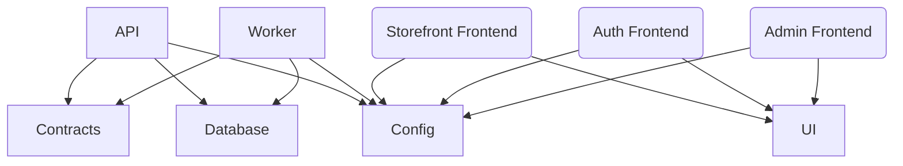

# Day 05 Report - Shared Packages, CI, dan Quality Gate

## Foundation Gate Passed

**Status:** `PASSED` **Tanggal:** 12 Juli 2026

### 1. Database Schema & ORM

- Drizzle ORM dan konfigurasi `drizzle-kit` berhasil di setup.
- File migrasi menggunakan `@neondatabase/serverless` dengan prefix tabel `sss_` berhasil
  men-generate struktur relasional.
- Skema yang berhasil dimodelkan: Identity, Catalog, Commerce, Notifications.

### 2. Export Surfaces Minimal

- `packages/auth`, `packages/contracts`, `packages/ui`, `packages/email`, `packages/database` telah
  memiliki `index.ts`/`index.tsx` dan `deno.json` exports yang valid dan mencegah circular
  dependency.
- Membuka ruang aman bagi frontend dan API untuk melakukan impor yang diperlukan dengan aman.

### 3. Centralized Environment Config

- Implementasi _parser_ variabel lingkungan berbasis `zod` di `packages/config/env.ts`.
- Pembagian domain: frontend (`VITE_API_URL`), API, worker, dan migration script
  (`DATABASE_URL_DIRECT`).
- Memisahkan `.env.example` dari rahasia sehingga developer bisa on-board dengan cepat.

### 4. CI/CD & Quality Gates

- **Format:** `deno fmt` bersih.
- **Lint:** `deno lint` bebas peringatan.
- **Type Checking:** `deno task check` telah terverifikasi seluruh repositori monorepo bebas dari
  kesalahan tipe (`TS2559` telah diperbaiki di UI).
- **Test:** Unit test (API envelope) `deno task test` berjalan hijau.
- **Build:** Seluruh 5 proyek _frontend_ berhasil di-_build_ secara sinkron.
- `ci.yml` untuk GitHub Actions telah ditambahkan.

### Dependency Graph (Internal)

Proyek ini telah resmi melewati masa **Foundation Gate** dan siap memasuki fase implementasi modul
bisnis!
